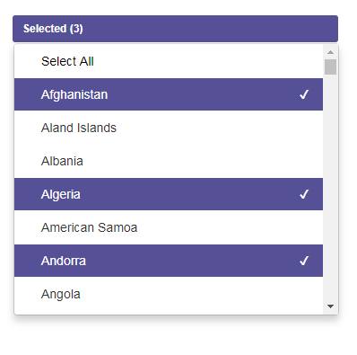
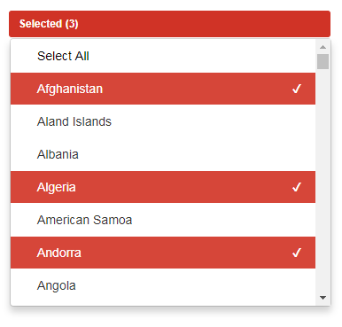

# Multi Select - jQuery multi-select plugin
Multi-select is a JQuery plugin to provide interface for using lists with the multiple selection without any select or input box.

### 1. Get a copy of the plugin
You can download the plugin from GitHub.

### 2. Load the required files
Inside the page's head tag include the multi-select's CSS file.
```
<link rel="stylesheet" type="text/css" href="css/multi.select.css" />
```

In the page's footer, just before, include the required JavaScript files.

```
<script src="js/multi.select.js"></script>
```

### 3. Create the HTML markup
`<div id="multi"></div>`

### 4. Instantiate the MultiSelect
```
<script type="text/javascript">
    jQuery( document ).ready(function( $ ) { 
        $( '#multi' ).multi_select({ 
            selectColor: 'red', // 'green', 'blue', 'aqua', 'red', 'yellow', 'maroon', 'purple'
            selectSize: 'small', // xsmall, small, big
            selectText: 'Select', // default select text
            selectedCount: 3, // show counter of selected list, if select more than this value
            duration: 300, // dropdown hide/show duration
            easing: 'slide', // slide/fade - dropdown hide/show transition
            listMaxHeight: 200, // dropdown max height
            selectedIndexes: null, // pre-selected values Array
            sortByText: false, // list sort by text or not
            fillButton: false, // Button fill with background or only border
            data: {
              "BD": "Bangladesh",
              "HK": "Hong Kong",
              "IN": "India",
              "AU": "Australia",
              ........
              ........
            },
            buttonWidth: '100%',
            onSelect: function() { return true; }
        }); 
    }); 
</script>
```
### 5. Other uses
```
- Get selected values
    $('#multi').multi_select('getSelectedValues');
- Clear values
    $('#multi').multi_select('clearValues');
- Re-initialize with Updated values
    $.multi_select.multi_select('init', {
              "BD": "Bangladesh",
              "IN": "India",
            });
```

### Example



### Demo
[Demo](https://jsfiddle.net/g_s_rajpurohit/Ln0u75vk/4/).

### Support
If you found a bug or have a feature suggestion, please email me on rajpurohitganpat@gmail.com.
If you need help with implementing the "Multi Select" in your project feel free to contact me on rajpurohitganpat@gmail.com.

License The plugin is available under the [MIT license](https://opensource.org/licenses/MIT).
